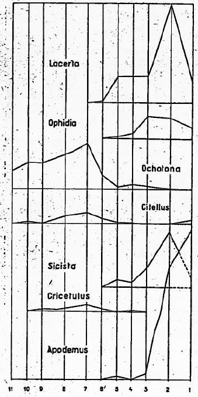
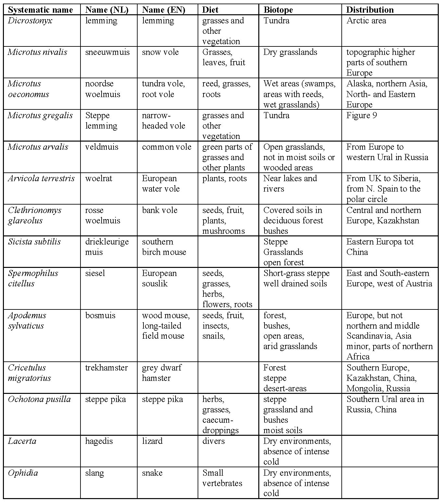

# Fossil rodents as palaeoenvironmental archives

Voles are rodents that are predominantly herbivorous and live in burrows. Vole populations can grow very large in a short time due to a high reproduction rate. Each species has a distinctive dentition (with prismatic hypsodont teeth) and is associated with a specific type of food and environment. Voles are widely used in the terrestrial fossil record to interpret paleoecology and paleoclimate, because their ecology makes them good environmental indicators:

- High abundance - it is possible to make quantitative studies and evaluate statistically the precision of ecological reconstructions
- Small size - it is possible to find a large fossil assemblage in a relatively small volume of rock or sediment (e.g. when outcrop area is limited or when we have to ship the samples to the lab - try this with a triceratops!)
- High preservation potential - as you already know, teeth are covered with a highly mineralized layer of enamel, which contains the mineral apatite. This makes teeth very resistant to chemical dissolution and mechanical fragmentation.
- High rates of morphological evolution - each species has different teeth
- Clear link between the morphology and diet (and thus vegetation available) - as you have seen in practical 4 (Cranial and dental adaptation), by studying teeth alone we can tell what food was available in the animal's habitat.

In this practical, the mammal succession in Pleistocene and Holocene deposits in the Jankovich cave (Hungary) will be studied. The succession comes from 11 successive layers in a 3 meters high section. The total material collected consists of some 20 000 fossils of large and small mammals.
The Jankovich Cave

The Jankovich Cave is situated about 40 kilometers NW of Budapest (Hungary) near Bajót. Its altitude is about 330 m.
Hungary has a relatively dry continental climate, with cold winters and warm summers. Average temperatures range from -1°C in January to 21°C in July. Rainfall is heaviest in early summer, and the average amount decreases from 787 millimeters along the western frontier to 508 millimeters in the east.

The first study using quantitative data from a succession of fossil rodent assemblages for paleoecological and paleoclimatic interpretations was by Kretzoi (1957):

Figure from Kretzoi M. (1957) Folia Archaeologica, 9, pp. 16 - 21.

This week's assignment will consist of two parts: Exercise I with microscopes and fossil specimens and Exercise II with R and fossil datasets. 
One third of you will work in the room with microscopes and then we will ask you to free up the microscopes and swap. If you are in the room without the microscopes, please start with Exercise 2.

## Objectives

After finishing this practical, you should be able to:

1. Recognize the dentitions of major rodent groups living in Europe today [Exercise I]
2. Understand how the nearest living relative principle is used to reconstruct past environments [Exercise II]
3. Use the present-day distributions and habitats of rodents for the interpretation of a late Pleistocene to Holocene faunal succession [Exercise II]
4. Carry out a quantitative analysis of changes in the composition of ecological groups of fossil fauna and present its results digitally in a reproducible way

## Instructions

II(a) Table 2 attached as a CSV file contains the relative frequencies of voles in the Jankovich cave. To make the findings comparable, 
first lower molars were counted, so e.g. if one individual left multiple teeth preserved, we wouldn't count it twice. 
You will use this data to construct an area chart. We provide an R code that will allow you to import this file and make this plot. 

II(b) Use the nearest living relative priniciple to reconstruct the environment of the fossils from the cave. 
Make a new version of Table 2, but instead of showing the proportions of taxa, extract the biotope rom Table 3 and apply it in the new 
version of Table 2. You are aiming for an area chart that shows the relative proportions of biotopes. 

So you may need to re-calculate the proportions. Use the same code as provided in II(a) but modify it to use the file you created and 
make sure the labels are adjusted accordingly.

II(c) In Table 4, also attached as a CSV file, the presence of other vertebrates other than voles is shown. 
Make the same set of area charts as in II(a) and II(b), but for these taxa. You will again have to modify the code and use the information from Table 3 to plot changes in organisms living in different biotopes.

II(d) Is the biotope area chart of II(c) the same as in question II(b)?

II(e) Are fossil mammals good indicators of past climate and vegetation? Well, we can find out by comparing with past vegetation. 
But how? The most important sources of information are pollen records and climate models. 
The latter often include information from the former. Here we show you one of several possible examples of obtaining data on past vegetation. 
This example relies on Open Science: an approach that requires authors of all studies to make their data and code available to anyone who would like to reproduce their results. 
Beyer et al. (2020) generated a model reoconstructing biomes on the Earth for the last 120 000 years. 
Biomes in palaeoclimatology have very standardized definitions and their occurrence can be predicted for palaeoclimatic data (Kaplan et al. 2003). 
[The data generated by the model can be downloaded from a public repository](https://figshare.com/articles/dataset/LateQuaternary_Environment_nc/12293345/3?file=22659026) (warning: big file!) and the authors provided the code to extract the information from it. We have already selected the part of the code that you need and included in the .R file attached to this assignment. As always, the code provided works if all the necessary files are in the working directory set for your R session. You can change the age in the code to generate maps of biomes for the ages of the faunal samples in this assignments. It is up to you how many maps you generate: look at the area chart and see when big climatic changes should happen: are they reflected in the map of biomes in Europe? Write a short commentary, referring to the figures you produced. It may be wise to number the figures.

## References

Beyer, R.M., Krapp, M. & Manica, A. High-resolution terrestrial climate, bioclimate and vegetation for the last 120,000 years. Sci Data 7, 236 (2020). https://doi.org/10.1038/s41597-020-0552-1
Kaplan, J. O., et al. (2003), Climate change and Arctic ecosystems: 2. Modeling, paleodata-model comparisons, and future projections, J. Geophys. Res., 108, 8171, doi:10.1029/2002JD002559, D19.
